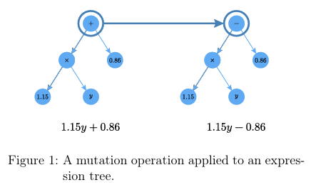
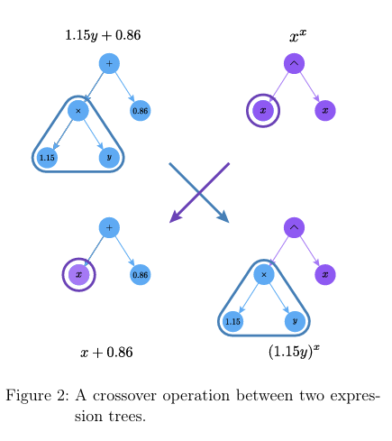

# Symbolic Regression: a Genetic Programming Approach

## A ground up implementation of genetic programming methods for symbolic regression

This serves as a complete implementation and illustration of a simple symbolic regression (SR)algorithm based on the genetic programming (GP) like mutations, crossovers, and natural selection. The notebook relies on the [**PySR**](https://arxiv.org/abs/2305.01582) library by Miles Cranmer and the [symbolic-regression-python](https://github.com/datarobot-community/symbolic-regression-python/tree/master) repository from _datarobot-community_.

## Introduction to Symbolic Regression

Symbolic regression in a supervised learning technique which seeks to infer some data's underlying mathematical function. This is different in some other regressions such as standard Least-Squares approximations they do not infer the mathematical structure of function but only its optimal parameters. It is also different from neural networks, support vector machines, and other non-structural learning algorithms as they are not easily interpretable. Symbolic regression, without prior structure determination, returns an interpetable and explicit function relating the data to its independent variables. However, this comes at the cost of computational inefficiency.

One of the first methods developped for symbolic regression was inspired by genetic programming principles. Overall, this method relies on generating a random population of functions, comparing them to the expected output, combining aspects of more fruitful functions, and repeating this process over generations. This principle of natural selection in the space of functions is designed to encourage function archetypes performing well until it converges to a function close to the expected output.

## Outline

This implementation of SR treats expressions as binary expression trees. A random population of functions is initially created. The fitness of these functions is then quantified using the Mean Square Error along with a penalty for increasing tree size. Then functions are drawn randomly and compared. The best performing ones will lead to an offspring in the subsequent generation. An offspring either results from a mutation of a single parent, from a combination of 2 parents, or a crossover between 2 parents.

### Combination

$$f_{\text{child}} = f_{\text{parent 1}}+f_{\text{parent 1}}$$

### Mutation

A mutation consists of swapping subtree for a new generated function.

### Crossover

A crossover consists of swapping a subtree of parent 1 with a subtree of parent 2.

